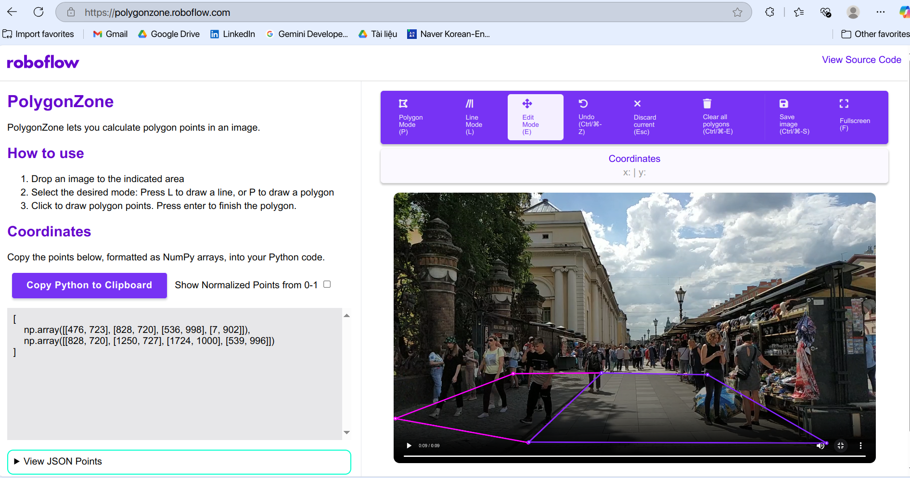

# 👁️‍🔮 People Counter with Age & Gender Prediction

Dự án AI giúc **đếm số lượng người** trong **khu vực khoanh vùng sẵn**, đồng thời **dự đoán tuổi và giới tính** của từng người, hiển thị trực tiếp trên màn hình giám sát.

## 📌 Mục tiêu
- 📍 Phát hiện người trong video/camera real-time.
- 🧠 Theo dõi người di chuyển trong khu vực đã định nghĩa (zone).
- 👨👩 Dự đoán tuổi và giới tính từ khuôn mặt người.
- 📺 Hiển thị số lượng người và thông tin lên màn hình.

## 📷 Demo
### 🎞️ Video 1:


### 🎞️ Video 2:


### 🎞️ Video 3:


*Ví dụ demo đang đếm người và dự đoán thông tin trong một khu vực cụ thể.*

## 🎯 Pipeline AI

📹 Video Input (.avi or .mp4)  
↓  
🧠 YOLO11n-pose → Person Detection, Tracking (ByteTrack)  
↓  
😶 Face Extraction  
↓  
🧓 Face Detection, Age & Gender Prediction (using InsightFace)  
↓  
📊 Hiển thị & đếm số người trong từng vùng.

## 🛠 Công nghệ sử dụng
- YOLO11n-pose – Phát hiện người, Theo dõi người
- InsightFace – Dự đoán tuổi, giới tính
- OpenCV – Hiển thị kết quả

## ⚙️ Cài đặt

```bash
git clone https://github.com/datnndd/People-Counter-with-Age-Gender-Prediction.git
cd People-Counter-with-Age-Gender-Prediction
pip install -r requirements.txt
```

## 🚀 Hướng Dẫn Sử Dụng

### Bước 1: Tạo vùng đếm (Polygon Zones)

1. Truy cập trang web: [https://polygonzone.roboflow.com/](https://polygonzone.roboflow.com/)
2. Tải lên khung hình (frame) từ video hoặc hình ảnh bạn muốn sử dụng làm nền tham chiếu.
3. Chọn chế độ **Polygon Mode**.
4. Dùng chuột để **vẽ các vùng đếm** theo hình dạng tùy ý.
5. Sau khi vẽ xong, **sao chép tọa độ các vùng (regions)** đã tạo.
6. Dán các tọa độ vào file `regions.json` theo định dạng mẫu đã cung cấp.


### Bước 2: Chạy chương trình

Mở terminal và chạy:

```bash
python last_ver.py \
    --source "video_test/test1.mp4" \
    --regions_config "regions.json" \
    --device "cpu" \
    --view_img True \
    --save_img True

//Thay 
--source 0: Sử dụng camera mặc định
--source 1: Sử dụng camera ngoài
```


## 📊 Kết quả hiển thị
- Số lượng người trong vùng đã định sẵn
- Tuổi (ước lượng)
- Giới tính
- Bounding box + ID người + Overlay trực quan

## 📁 Các tính năng có thể mở rộng thêm
- Ghi file
- Cải thiện khả năng nhận diện đối tượng với SAHI

## Tài liệu tham khảo
- [https://polygonzone.roboflow.com/](https://github.com/ultralytics/ultralytics/blob/main/examples/YOLOv8-Region-Counter)
- [https://polygonzone.roboflow.com/](https://github.com/ultralytics/ultralytics/tree/main/examples/YOLOv8-SAHI-Inference-Video)
## 🤝 Đóng góp
Mọi ý kiến đóng góp đều rất được hoan nghênh! Bạn có thể tạo `Issue` hoặc gửi `Pull Request` nếu muốn cải thiện dự án.
